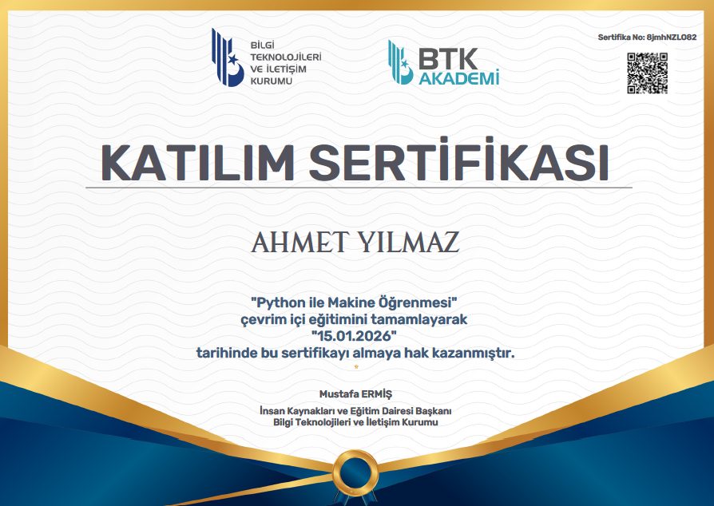
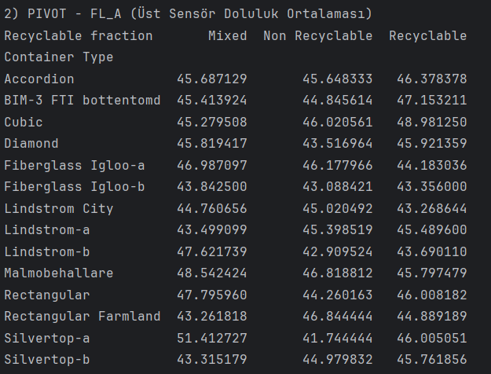
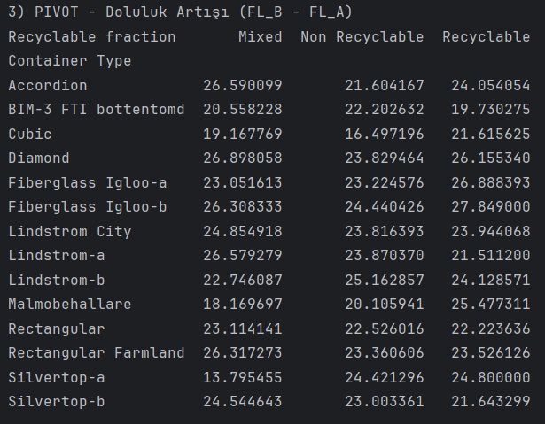
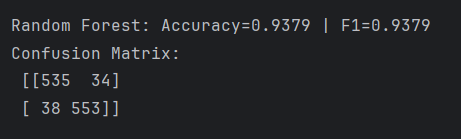
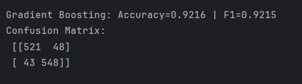
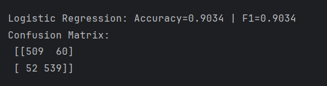
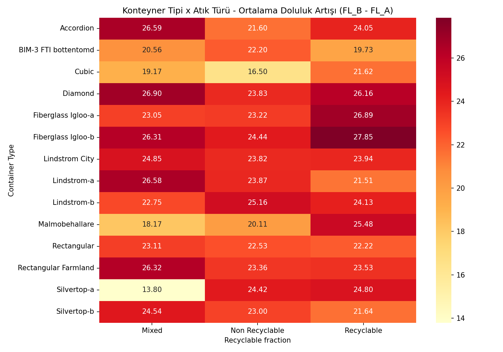
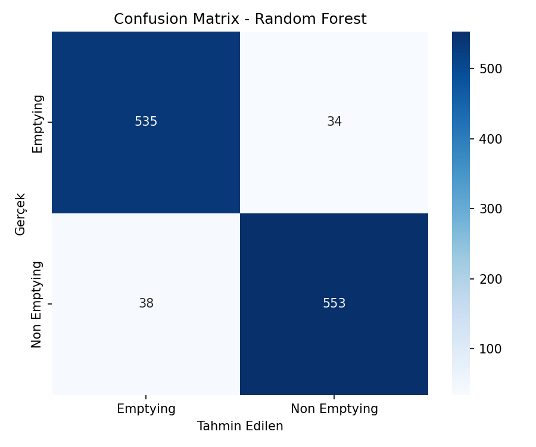

# Smart Bin Projesi - Doluluk Tahmini ve Sınıflandırma

Bu projede, akıllı çöp kutularından gelen sensör verileriyle, bir çöp kutusunun boşaltılması gerekip gerekmediğini tahmin eden bir model yapmaya çalıştım.

---

## Sertifikalar

### Makine Öğrenmesi Sertifikası

### Python Sertifikası

---

## Proje Amacı

Bu projedeki amacım, çöp toplama işini daha verimli hale getirmek. Bunun için de akıllı çöp kutularının doluluk durumuna bakıp, en doğru zamanda boşaltılmasını sağlamaya çalıştım.

Yapmak istediklerim:
- Hangi konteyner tipi hangi atıkta daha hızlı doluyor bulmak
- Sensör verilerini kullanarak boşaltma kararı tahmin etmek
- Farklı modelleri deneyip hangisi daha iyi görmek

---

## Veri Seti

Kullandığım veri seti `Smart_Bin.csv` dosyası. İçinde 4638 tane kayıt ve 10 tane sütun var.

### Değişkenler ne anlama geliyor?
- Class: Kutunun boşaltılıp boşaltılmadığı (Hedef değişkenim bu).
- FL_B, FL_A: Alttaki ve üstteki sensörlerin ölçtüğü doluluk.
- VS: Hacim sensörü.
- FL_B_3, FL_A_3: 3 saat önceki doluluklar.
- FL_B_12, FL_A_12: 12 saat önceki doluluklar.
- Container Type: Konteynerin tipi (Kübik, Elmas şeklinde vs.).
- Recyclable fraction: İçindeki atığın türü (Karışık, Geri dönüştürülebilir vb.).

---

## Pivot Tablo Analizi

Hangi konteyner tipi hangi atık türünde daha hızlı doluyor bulmak için pivot tablo yaptım.

Neden pivot tablo yaptım?
- FL_A ve FL_B arasındaki farka bakınca doluluk artışını görebiliyorum
- Bu farkı hesaplayıp konteyner ve atık türüne göre gruplayınca hangi kombinasyonun daha hızlı dolduğunu anlayabiliyorum
- Bu sayede en hızlı dolan çöp kutusu + atık türünü bulabiliyorum

### 1. FL_B (Alt Sensör) Ortalamaları

### 2. FL_A (Üst Sensör) Ortalamaları

### 3. Doluluk Artışı (FL_B - FL_A)

---

## Veri Ön İşleme

Veride birkaç tane eksik Container Type değeri vardı, onları en çok tekrar eden değer (mod) ile doldurdum.

Kategorik değişkenleri sayıya çevirmek için LabelEncoder kullandım. Çünkü makine öğrenmesi modelleri sayıları anlıyor, yazıları anlamıyor.

- Container Type → Container_Enc
- Recyclable fraction → Recyclable_Enc
- Class → y (bu bizim tahmin etmeye çalıştığımız şey)

Veriyi de %75 eğitim, %25 test olarak ikiye böldüm.

EN HIZLI DOLAN KOMBINASYON: Fiberglass Igloo-b + Recyclable

---

## Kullanılan Modeller

3 farklı model denedim:
1. Random Forest
2. Gradient Boosting
3. Logistic Regression

Her birini eğitip test ettim.

### Random Forest Sonuçları

### Gradient Boosting Sonuçları

### Logistic Regression Sonuçları

---

## Kod Çalışınca Oluşan Görseller

### Pivot Heatmap
Kod çalışınca, hangi çöp kutusu ve atık türünün ne kadar hızlı dolduğunu gösteren böyle bir ısı haritası (heatmap) çıkıyor. Koyu renkler daha hızlı dolanları gösteriyor.

### Confusion Matrix
En iyi çalışan modelin başarı durumunu gösteren bu grafik de otomatik çiziliyor. Hangi sınıfları doğru, hangilerini yanlış tahmin etmiş görebiliyoruz.

---

## smart_bin_classification.py Kod Açıklaması

Kodun yaptığı işler kısaca şöyle:
1.  `Smart_Bin.csv` dosyasını okuyor.
2.  Dolma hızını hesaplamak için iki sensör verisi arasındaki farkı alıyor.
3.  Bu hızlara göre pivot tablolar ve bir ısı haritası oluşturup `images` klasörüne kaydediyor.
4.  Verideki eksik kısımları dolduruyor ve `LabelEncoder` ile yazıları sayılara çeviriyor (modellerin anlayacağı dile).
5.  Veriyi eğitim ve test olarak ikiye ayırıyor.
6.  Random Forest, Gradient Boosting ve Logistic Regression modellerini deneyip sonuçlarını (Accuracy, F1-Score) karşılaştırıyor.
7.  En iyi modelin confusion matrix'ini çizip yine `images` klasörüne atıyor.

---

## Sonuç

Sonuç olarak, bu projede hem veri analizi yaptım hem de makine öğrenmesi modelleri denedim. Yaptığım analizde, en hızlı dolan konteyner tipi ile atık türünü buldum. Denediğim modeller arasında da en iyi sonucu Random Forest verdi.
